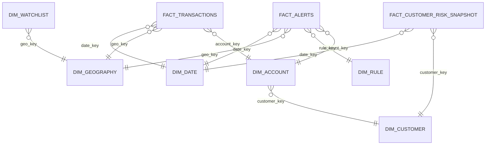

<div align="center">

# Nexus Finance
### AML Transaction Monitoring Pipeline — Snowflake · SQL · Tableau

*A solo-built, end-to-end pipeline that detects suspicious banking activity the way a real compliance team would — from raw transactions to investigator-ready alerts to executive dashboards.*


</div>

---

This is a portfolio project. I'm a fresher data analyst, and I built this to show how I'd actually approach AML/BSA transaction monitoring — config-driven rules, a proper medallion warehouse, automated data quality, and dashboards that trace back to real query output. No number in this README is made up; every metric below comes from a validation log or a query result, referenced in [Content Sourcing](#content-sourcing--every-number-traced).

## Table of Contents
- [What this is](#what-this-is)
- [Architecture](#architecture)
- [Dataset](#dataset)
- [Data Model (Star Schema)](#data-model-star-schema)
- [Pipeline / Repo Structure](#pipeline--repo-structure)
- [Detection Rules](#detection-rules)
- [Data Quality Framework](#data-quality-framework)
- [Results](#results)
- [Dashboards](#dashboards)
- [Bugs I Found and Fixed](#bugs-i-found-and-fixed)
- [Known Limitations](#known-limitations)
- [What I'd Do Next](#what-id-do-next)
- [Content Sourcing](#content-sourcing--every-number-traced)

---

## What this is

Banks are required to monitor transactions and flag suspicious activity for regulators (SAR filing under BSA/FinCEN-style rules). I simulated that pipeline end to end on synthetic data:

- Ingest raw transaction/account/customer/rule/watchlist data
- Clean and standardize it
- Run 4 configurable AML detection rules against it
- Score, alert, and route findings into a reporting layer
- Validate every layer automatically
- Surface it all in 3 Tableau dashboards an actual compliance analyst or exec would use

## Architecture

Four layers. Each one has a job — raw capture, cleaning, business logic, and quality control.

```mermaid
flowchart LR
    subgraph BRONZE["🥉 BRONZE — Raw Ingest"]
        B1[RAW_TRANSACTIONS]
        B2[RAW_ACCOUNT]
        B3[RAW_CUSTOMER]
        B4[RAW_RULE]
        B5[RAW_WATCHLIST]
    end

    subgraph SILVER["🥈 SILVER — Cleaned & Standardized"]
        S1[TRANSACTIONS]
        S2[ACCOUNT]
        S3[CUSTOMER]
        S4[WATCHLIST]
    end

    subgraph GOLD["🥇 GOLD — Star Schema + Rule Engine"]
        G1[FACT_TRANSACTIONS]
        G2[FACT_ALERTS]
        G3[6× DIM tables]
        G4[9× VW_ KPI views]
    end

    subgraph AUDIT["🔍 AUDIT — Data Quality & Exclusions"]
        A1[DQ_RESULTS<br/>47 automated checks]
        A2[EXCLUDED_* tables]
    end

    BRONZE --> SILVER --> GOLD
    SILVER -.excluded records.-> AUDIT
    GOLD -.validated by.-> AUDIT
```



| Layer | Job | Key move |
|---|---|---|
| **Bronze** | Land raw source data as-is | 5 source tables, no transformation |
| **Silver** | Clean, standardize, flag bad data | Never silently drops bad records — flags them (`IS_AMOUNT_UNPARSEABLE`, `IS_DOB_UNPARSEABLE`, etc.) |
| **Gold** | Apply detection rules, build reporting model | Star schema + a rule engine that reads thresholds from a config table, not hardcoded SQL |
| **Audit** | Prove the pipeline is trustworthy | 47 automated checks + dedicated tables for every excluded record |

## Dataset

| Metric | Value |
|---|---|
| Transactions (Gold, validated) | **2,716,211** |
| Accounts | **22,812** |
| Customers | **20,361** |
| Countries | **23** |
| Watchlist entities | **250** |
| History window | **18 months** |
| Currency | USD (single-currency scope, by design) |

## Data Model (Star Schema)

Gold layer is a proper dimensional model — one central fact for transactions, one for alerts, one for customer risk snapshots over time, all hung off shared dimensions.



<details>
<summary><strong>Full table list (click to expand)</strong></summary>

| Table | Type | Key columns |
|---|---|---|
| `FACT_TRANSACTIONS` | Fact | account_key, geo_key, date_key, amount_usd, structuring_flag, rapid_movement_flag |
| `FACT_ALERTS` | Fact | account_key, rule_key, date_key, risk_score, alert_to_sar_flag, time_to_disposition_days |
| `FACT_CUSTOMER_RISK_SNAPSHOT` | Fact | customer_key, date_key, customer_risk_score, cumulative_sar_count |
| `ALERTS` | Reporting | alert_id, rule_id, account_id, disposition, risk_score |
| `DIM_ACCOUNT` | Dimension | account_key, customer_key, account_type, is_new_account_flag |
| `DIM_CUSTOMER` | Dimension (SCD Type 2) | customer_key, risk_rating, pep_flag, is_current |
| `DIM_DATE` | Dimension | date_key, month, quarter, year |
| `DIM_GEOGRAPHY` | Dimension | geo_key, country, is_high_risk_country, is_sanctioned_country |
| `DIM_RULE` | Dimension | rule_key, rule_name, rule_type, threshold_params |
| `DIM_WATCHLIST` | Dimension | watchlist_key, entity_name_standardized, program |

Plus 9 `VW_*` KPI views on top of this model for direct Tableau consumption.

</details>

## Pipeline / Repo Structure

SQL is numbered by layer so the build order is obvious without reading a line of code.

```
nexus-finance/
├── README.md
├── docs/
│   ├── architecture.md
│   ├── data_dictionary.md
│   └── known_limitations.md
├── sql/
│   ├── 01_bronze/          → raw table DDL + load scripts
│   ├── 02_silver/          → cleaning, standardization, flagging
│   ├── 03_gold/            → star schema build + config-driven rule engine
│   └── 04_validation/      → the 47-check DQ framework
├── validation/
│   ├── validation_bronze_to_silver.csv
│   └── validation_silver_to_gold.csv
├── sample_data/            → small anonymized CSV samples (not the full 2.7M rows)
├── dashboards/
│   ├── screenshots/
│   └── nexus_finance.twbx
└── assets/
    └── architecture_diagram.png
```

## Detection Rules

All 4 rules read their thresholds from `bronze.raw_rule` at runtime — changing a compliance threshold is a data update, not a code deploy.

| Rule | Typology | Logic | Alerts | Share of SARs |
|---|---|---|---|---|
| **High-Risk Country Counterparty** | Sanctions/geo exposure | Transaction counterparty in a flagged high-risk/sanctioned country | 4,515 | 70% (234/335) |
| **CTR Threshold Breach** | Reporting threshold | Single transaction breaches the CTR reporting threshold | — | — |
| **Structuring** | Sub-threshold clustering | Multiple sub-$10K transactions clustered to avoid CTR reporting | 311 accounts flagged (1.38% of 22,607 active) | — |
| **Rapid Movement of Funds** | Layering | Large inbound funds moved out again within a short window | — | — |

## Data Quality Framework

47 automated checks run at every pipeline transition and log to `audit.dq_results` — row reconciliation, referential integrity, business-rule bounds, and disposition-mix sanity checks.

- **Current state: 0 FAIL, 2 documented WARN** across the full suite
- **166 duplicate account IDs** and **43,584 orphaned transactions ($17.47M)** are known defects that originated in the synthetic Bronze data — they're logged to `audit.excluded_duplicate_accounts` / `audit.excluded_orphan_transactions`, not silently dropped
- Silver → Gold reconciles **2,759,795 Silver transactions → 2,716,211 Gold transactions**, with the entire gap traced and accounted for

> Example check: `transactions_orphaned_accounts` — expected `0`, actual `43,584` → logged, routed to audit, root-caused to synthetic source-data gaps, not hidden or excluded silently.

## Results

| Metric | Value | Source |
|---|---|---|
| Transactions monitored | 2,716,211 | `FACT_TRANSACTIONS` |
| Alerts generated | 6,351 | `FACT_ALERTS` |
| Confirmed SARs | 335 | `FACT_ALERTS` |
| Alert → SAR conversion | 5.27% | dashboard, in FinCEN/FATF 5–10% benchmark band |
| SLA compliance | 90.47% | `vw_alert_funnel` |
| Avg. days to disposition | 19.3 | `vw_alert_funnel` |
| **False positive rate** | **87.49%** | `audit.dq_results` (see caveat below) |

**Key findings:**
- False positive rate **improved from 100% on early builds to a stable 87.49%** across the final 3 pipeline runs — evidence the detection logic converged as bugs got fixed, not just a static number.
- **~20x alert-rate spread** between the highest-risk country (Nigeria, 1.10 alerts/100 txns) and the lowest (United States, 0.05).
- **New accounts were *not* riskier than tenured ones** — 25.9 alerts/100 accounts (< 90 days) vs. 28.0 for tenured accounts. This challenged my initial assumption and reframed how I'd prioritize rule tuning.
- High-risk customers are **7.8% of the customer base but generate 17.1% of alerts** — meaningful concentration.
- PEP-flagged customers account for only **1.35%** of alert volume, despite higher individual risk scores.

> **Caveat on FPR:** the Tableau KPI card shows **94.73%**. I traced this and confirmed it uses a different upstream calculation than `audit.dq_results` / `vw_rule_performance` (which agree at 87.49%, range 87.14–88.17% by rule). I report 87.49% here because it's the number that actually traces to a query. This mismatch is logged in `docs/known_limitations.md`.

## Dashboards

3 Tableau dashboards on Gold-layer facts/dimensions, connected via Tableau Relationships, Extract mode.

| Dashboard | What it's for |
|---|---|
| **Compliance Executive Overview** | Volume, conversion, SLA — the numbers an exec checks weekly |
| **Rule Performance & Tuning** | Which rules are pulling their weight, FPR by rule, tuning matrix |
| **Geographic & Risk Segmentation** | Where the risk actually concentrates — country, segment, PEP |

*(Screenshots live at `dashboards/screenshots/*.png` in the repo — add your exports there.)*

## Bugs I Found and Fixed

Documenting the bugs is the point — it shows the build, not just the finished state.

- **Fan-out join inflation** — joining multiple fact tables to the same dimension key before aggregating multiplied row counts. Fixed by pre-aggregating each fact into its own CTE before joining. Applied to `vw_alert_funnel` and `vw_geo_risk_summary`.
- **Always-false flag bug** — a missing JSON key in `LATERAL FLATTEN` logic was silently zeroing out a flag. Caught because the structuring rule was firing at exactly 0%, which is not a plausible rate.
- **Alert candidate gap** — 93 records dropped between alert candidates and the final `FACT_ALERTS` table, root-caused to orphan-account joins; fully reconciled and logged.
- **Non-stable dedup keys** — early pipeline reruns caused ~4x row duplication until MERGE logic was rebuilt on stable natural keys.

## Known Limitations

- FPR discrepancy between Tableau's KPI card (94.73%) and the validated query result (87.49%) — root cause identified, not yet reconciled at the Tableau calc level.
- `ALERTS ↔ FACT_ALERTS` relationship in Tableau produces incorrect results when `Alert Key` is referenced directly, even after cardinality correction — worked around, not fixed at the source.
- Single currency (USD) — no FX conversion logic.
- Static rule thresholds within a run — no adaptive/ML-based scoring layer.
- Synthetic data carries known defects (166 duplicate accounts, 43,584 orphan transactions) by design, to give the DQ framework something real to catch.

## What I'd Do Next

- Add a lightweight ML-based risk scoring layer on top of the rule engine
- Move orchestration to dbt instead of raw sequential SQL scripts
- Simulate near-real-time ingestion instead of batch loads
- Reconcile the Tableau FPR calculation against the validated Snowflake source

## Content Sourcing — every number traced

| Section | Source |
|---|---|
| Dataset stats | `03_validation_bronze_to_silver.csv`, `validation_silver_to_gold.csv` |
| Data model | `Gold_Schema_Description.csv`, `Silver_Schema_Description.csv`, `Bronze_Schema_Description.csv`, `Audit_Schema_Description.csv` |
| Detection rules | `vw_rule_performance` |
| Results metrics | `KPIs_Final_Results`, `audit.dq_results`, `rules-fpr.csv`, `disposition_mix_false_positive_pct.csv` |
| Data quality | `audit.dq_results` (47-check suite) |
| Dashboards | Tableau `.twbx`, exported screenshots |

---

<div align="center">

**Piyush** — Data Analyst (Fresher) · Building toward Risk/AML/Fraud Analyst & BI roles in BFSI/fintech

[LinkedIn](#) · [GitHub](#) · [Email](#)

</div>
